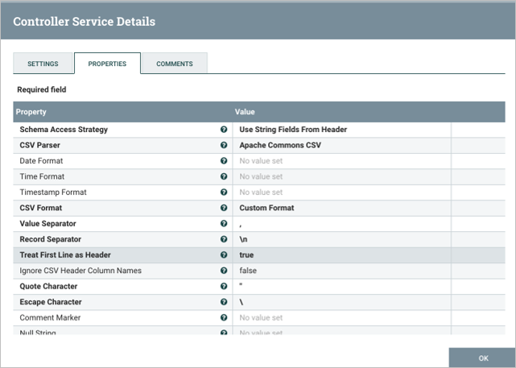
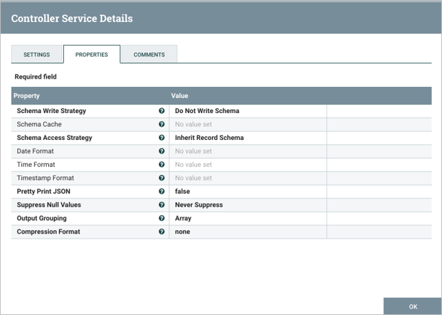

## In this assignment, you will practice performing ETL on a database that contains information about some movies by constructing NiFi pipelines that act first on an Excel file and then on a MySQL database. In the first part of the assignment, you will be challenged to construct a NiFi pipeline to move your data from an Excel file to a .csv file. In the second part of the assignment you will be required to move the data from a .csv file to a MySQL database using a NiFi pipeline.

Note that this assignment has been tested using a Windows OS and the Catalina version of a Mac OS. If you use the Big Sur OS, you are recommended to use the myPhpAdmin container as demonstrated in this article: Run MySQL & phpMyAdmin Locally Using Docker.Links to an external site.

To complete this assignment, follow these steps:

## Before you begin the steps of the assignment below, please be sure you have your two containers running within Docker and that they are connected to the same network titled netassignment; one container is for the NiFi server and one is for MySQL. Name the NiFi container nifi and the MySQL container mysql.

`docker network create netassignment`

`docker run --name nifi -p 8080:8080 --network netassignment -d apache/nifi:1.13.2`

`docker run --name mysql -p 3307:3306 --network netassignment -e MYSQL_ROOT_PASSWORD=MyNewPass -d mysql:8.0`

The driver must also be configured as demonstrated in Video 17.6.

go to dev.mysql.com/downloads/connector/j to download the 'platform independent' driver

Make a drivers folder in nifi container /opt/nifi/

`mkdir drivers`

Copy driver into nifi container
`docker cp ./mysql-connector-j-9.0.0/mysql-connector-j-9.0.0/mysql-connector-j-9.0.0.jar nifi:/opt/nifi/drivers`

In http://localhost:8080/nifi/
click gear on left
controller services > + > DBCPConnectionPool > configure that by clicking gear icon > rename to MySQL > properties > connection url: jdbc:mysql://mysqlcontainer:3306
We can see the mysqlcontainer from the nifi container because we set up the netassignment earlier.
Set the database driver class name to: com.mysql.jdbc.Driver
Set the database driver location: /opt/nifi/drivers/mysql-connector-j-9.0.0.jar
Set database user: root
Set database password: MyNewPass
Apply then enable with scope service and referencing components

## Part 1: Writing Data to an Excel File

For the first part of this assignment, you will use the movies.xlsx file.

Open the CLI for the NiFi container. In the container bash window, navigate inside the /opt/nifi/nifi-current folder and create two folders within it: input and output. 

`mkdir input`
`mkdir output`

Provide a screenshot to show that you successfully created the two folders.

Use the Docker copy command below to copy the movies.xlsx file from your local machine in the input folder inside of your NiFi Docker container:

`docker cp ./movies.xlsx nifi:/opt/nifi/nifi-current/input`

Provide a screenshot to show that you successfully copied the movies.xlsx file in the input folder.

Open the NiFi UI in your browser. Create a new process group and name it Assignment17. Provide a screenshot to show that you successfully created the Assignment17 process group.

Add a GetFile processor. Provide a screenshot to show that you successfully added the GetFile processor to the NiFi canvas. In the SCHEDULING tab, set the Run Schedule field equal to 15 seconds. In the PROPERTIES tab, set the Input Directory field equal to /opt/nifi/nifi-current/input, and set the File Filter field equal to the Excel file name to be processed, in this case, movies.xlsx. Provide a screenshot to show that you correctly configured the properties for the GetFile processor.

Add a processor titled ConvertExcelToCSVProcessor. In the SCHEDULING tab, set the Run Schedule field equal to 15 seconds. In the PROPERTIES tab, set the Sheets to Extract field equal to Sheet 1 - movies. Provide a screenshot to show that you configured the properties for the ConvertExcelToCSVProcessor processor correctly.

Add a PutFile processor. In the SETTINGS tab, select success and failure to Automatically Terminate Relationships. In the SCHEDULING tab, set the Run Schedule field equal to 15 seconds. In the PROPERTIES tab, set the Directory field equal to /opt/nifi/nifi-current/output. Provide a screenshot to show that you correctly configured the properties for the PutFile processor.

Connect the GetFile processor to the ConvertExcelToCSVProcessor processor. Select success for the relationship. Connect the ConvertExcelToCSVProcessor processor to the PutFile processor. Select failure, original, and success for the relationships. Provide a screenshot to show that you successfully connected all the processors with the correct relationships.

Start the GetFile, ConvertExcelToCSVProcessor, and PutFile processors. Provide a screenshot to show that all the processors are running (as indicated by a green arrow).

Navigate to the /opt/nifi/nifi-current/output folder in the NiFi CLI, and list the files. Verify that the processor has created a CSV file for processing. Provide a screenshot to show that the movies_Assignment.csv file has been created. Actually, the output csv is name 'movies_Sheet 1 - movies.csv', and it was only transferring the first column, so I removed the main header. Could have also set the number of rows to skip to 1 to skip the main header row.

## Part 2: Writing Data to an SQL Database

For the second part of this assignment, you will use the movies.csv file.

Using MySQL Workbench, create a new database called movielens and generate the movies table with the following three column fields:

`CREATE DATABASE IF NOT EXISTS movielens;`
`USE movielens;`

create TABLE movies(
    movieId int,
    title varchar(100),
    genres varchar(100)
);
Confirm that you have an empty table. Perform the following function:

SELECT * FROM movies

Provide a screenshot of your MySQL Workbench to show that you have successfully initialized an empty movies table in the movielens database.

Download the movies.csv CSV file and place it on your NiFi server in a newly created directory with the path /opt/nifi/nifi-current/data.

To do this, open the NiFi CLI in the Terminal through your Docker window and navigate to the following path: opt/nifi/.

In the nifi-current directory, create a data subdirectory within it. 

`mkdir data`

Open up a second Terminal window on your local machine and navigate to the folder where you downloaded the movies.csv file. Perform the following command:

`docker cp ./movies.csv nifi:/opt/nifi/nifi-current/data`

Navigate back to the NiFi CLI window. Provide a screenshot to show that the movies.csv file is now on the NiFi server.

Create reader and writer processors. The reader will read the data from your FlowFiles and the writer will write the data to MySQL commands.

To create a reader, go to the controller services, select the “+” option, and search for “CSVReader”. Open up the configurations and confirm that your screen looks similar to the following:

To create a writer, select the “+” option, and search for “JsonRecordSetWriter”. Open up the configurations and confirm that your screen looks similar to the following:

Select the lightning bolt symbol to start up each controller and select “Service Only” under the service and reference components menu.

Provide a screenshot of the controller screen to show that the three controller services (reader, writer, and MySQL) are enabled.

Now it is time to set up the data pipeline. This will consist of five processors flowing in the order specified below:

A GetFile processor (titled get movies file): In the PROPERTIES tab, set the input directory equal to /opt/nifi/nifi-current/data.
A SplitText processor: In the SETTINGS tab, select failure and original to Automatically Terminate Relationships. In the PROPERTIES tab, set the Line Split Count and Header Line Count fields both equal to 1.
A ConvertRecord processor: In the Settings tab, under Automatically terminate relationships, check failures. In the PROPERTIES tab, set the Record Reader field equal to CSVRead and the Record Writer field equal to JsonRecordWriter.
A ConvertJSONToSQL processor: In the SETTINGS tab, select failure and original to Automatically Terminate Relationships. In the PROPERTIES tab, set the JDBC Connection Pool field equal to MySQL, the Statement Type field equal to INSERT, the Table Name field equal to movies, and the Catalog Name field equal to movielens.
A PutSQL processor: In the SETTINGS tab, select failure and success to Automatically Terminate Relationships. In the PROPERTIES tab, set the JDBC Connection Pool field equal to MySQL.
Provide a screenshot of your complete data pipeline, including all five processors: GetFile, SplitText, ConvertRecord, ConvertJSONToSQL, and PutSQL.

Connect the processors.

The connector between the GetFile and SplitText processors will be a success relationship.
The connector between the SplitText and ConvertRecord processors will be a splits relationship.
The connector between the ConvertRecord and ConvertJSONToSQL processors will be a success relationship.
The connector between the ConvertJSONToSQL and PutSQL processors will be a sql relationship.
The final connector will stem from the PutSQL processor and loop back to itself. This will be a retry relationship.
Provide a screenshot of all five processors to show that the correct connectors have been added between the processors.

Start each processor, beginning with the GetFile processor. Watch the data propagate down toward the PutSQL processor. Provide a screenshot of your NiFi browser screen to show that all five processors are connected and running.

Navigate back to your MySQL Workbench and perform the following query:

SELECT * FROM movies;

There should now be rows of data which you loaded into the table. Provide a screenshot of the result of this query to show that the movies table in the movieslens database is now saturated with data.