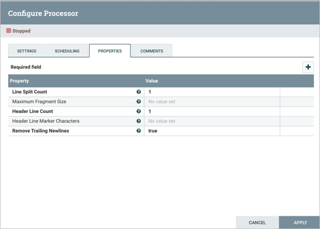
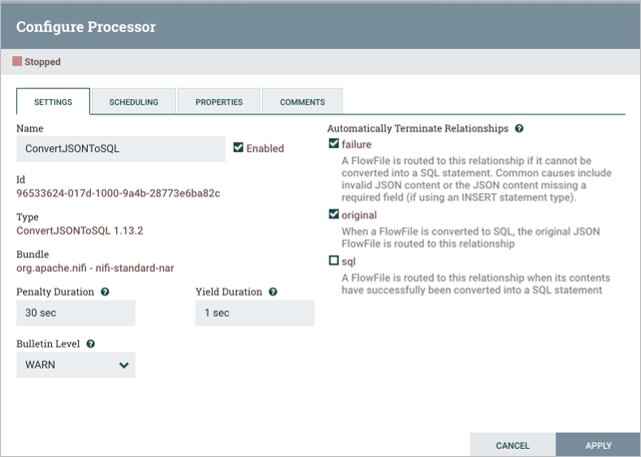

In this activity, you will use NiFi to perform a csv data load into a MySQL database. You will be using real earthquake data from USGS Links to an external site.and storing it within your database. This activity uses content from Videos 17.4, 17.5, 17.6, and 17.7, and you will need to follow along with the videos to create two containers before beginning this activity.

Before you begin the steps of the activity below, please be sure you have your two containers running within Docker and that they are connected to the same network; one container is for the NiFi server and one is for MySQL.
`docker network create NifiNetwork`

`docker run --name nificontainer -p 8080:8080 --network NifiNetwork -d apache/nifi:1.13.2`

`docker run --name mysqlcontainer -p 3307:3306 --network NifiNetwork -e MYSQL_ROOT_PASSWORD=MyNewPass -d mysql:8.0`

Prior to beginning this activity, review the submission instructions below to ensure that you collect the required screenshots as you progress through the activity.

Note that this activity has been tested using a Windows OS and the Catalina version of a Mac OS. If you use the Big Sur OS, you are recommended to use the myPhpAdmin container as demonstrated in this article: Run MySQL & phpMyAdmin Locally Using Docker Links to an external site. Links to an external site..

References

USGS. “Search Earthquake Catalog.” USGS: Science for a Changing World. Accessed December 14, 2021.  Links to an external site.https://earthquake.usgs.gov/earthquakes/search/.Links to an external site.

Yuste, Miguel. “Run MySQL & PhpMyAdmin Locally in 3 Steps Using Docker.” Medium. 2019. https://migueldoctor.medium.com/run-mysql-phpmyadmin-locally-in-3-steps-using-docker-74eb735fa1fc.Links to an external site.

To complete this activity, follow these steps:

First, you will configure your database in MySQL Workbench. You are going to generate a new database called usgs and, within that database, you will add a table called earthquakes. Run the following query to generate the database:

CREATE DATABASE IF NOT EXISTS usgs;
USE usgs;

Next, generate the earthquakes table with these 23 column fields:

 create TABLE earthquakes(
    idx int,
    time varchar(100),
    latitude varchar(100),
    longitude varchar(100),
    depth varchar(100),
    mag varchar(100),
    magType varchar(100),
    nst varchar(100),
    gap varchar(100),
    dmin varchar(100),
    rms varchar(100),
    net varchar(100),
    id varchar(100),
    updated varchar(100),
    place varchar(100),
    type varchar(100),
    horizontalError varchar(100),
    depthError varchar(100),
    magError varchar(100),
    magNst varchar(100),
    status varchar(100),
    locationSource varchar(100),
    magSource varchar(100)
);
Confirm that you have an empty table. Perform the following function:

SELECT * FROM earthquakes

Provide a screenshot of your MySQL Workbench to show that you have successfully initialized an empty earthquakes table in the usgs database.

Download the Activity17-2.csv CSV file and place it on your NiFi server in a newly created directory with the path /opt/nifi/nifi-current/data.

To do this, open the NiFi CLI in the Terminal through your Docker window and navigate to the following path: opt/nifi/.

Create a directory called current-nifi and create a data subdirectory within it. 

`mkdir data`

Open up a second Terminal window on your local machine and navigate to the folder where you downloaded the Activity17-2.csv CSV file. Perform the following command:

`docker cp ./Activity17-2.csv nificontainer:/opt/nifi/nifi-current/data`

Navigate back to the NiFi CLI window. Provide a screenshot to show that the Activity17-2.csv CSV file is now on the NiFi server.

`ls`

Open NiFi in your browser. You should already have a controller service called MySQL. The MySQL service will be set up exactly the same as in Video 17.7. The driver must also be configured, as demonstrated in Video 17.6. 

go to dev.mysql.com/downloads/connector/j to download the 'platform independent' driver

Make a drivers folder in nifi container /opt/nifi/

`mkdir drivers`

Copy driver into nifi container
`docker cp ./mysql-connector-j-9.0.0/mysql-connector-j-9.0.0/mysql-connector-j-9.0.0.jar nificontainer:/opt/nifi/drivers`

In http://localhost:8080/nifi/
click gear on left
controller services > + > DBCPConnectionPool > configure that gear > rename to MySQL > properties > connection url: jdbc:mysql://mysqlcontainer:3306
We can see the mysqlcontainer from the nifi container because we set up the NifiNetwork earlier.
Set the database driver class name to: com.mysql.jdbc.Driver
Set the database driver location: /opt/nifi/drivers/mysql-connector-j-9.0.0.jar
Set database user: root
Set database password: MyNewPass
Apply then enable with scope service and referencing components

Next, you are going to add two more controller services: a reader and a writer. The reader is going to read the data from your FlowFiles, and the writer will write the data to MySQL commands.

To create a reader, go to the controller services, select the “+” option and search for “CSVReader”. Open up the configurations and confirm that your screen looks like the following:

To create a writer, select the “+” option again and search for “JsonRecordSetWriter”. Open up the configurations and confirm that your screen looks like the following:

Select the lightning bolt symbol to start up each controller and select “Service Only” under the service and reference components menu.

Provide a screenshot of the controller screen to show that the three controller services (reader, writer, and MySQL) are enabled.

Now it is time to set up the data pipeline. This will consist of five processors flowing in the order specified below:

GetFile processor.

Create the GetFile processor.

SplitText processor:

Create the SplitText processor.

Properties of the SplitText processor.

ConvertRecord processor:

Note that this is where you will use the reader and writer controllers that you configured in Step 3.

Create the ConvertRecord processor.

Properties of the ConvertRecord processor.

ConvertJSONToSQL processor:

Create the ConvertJSONToSQL processor.

Properties of the ConvertJSONToSQL processor.

PutSQL processor:

Create the PutSQL processor.

Properties of the PutSQL processor.

Provide a screenshot of your complete data pipeline, including all five processors: GetFile, SplitText, ConvertRecord, ConvertJSONToSQL, and PutSQL.

Now that you have all five processors configured, you must make connections. There will be a total of five connectors. The first four connectors will connect the five processors, and the last connector will be a loop connector over the last processor, PutSQL, to handle retries. Retries are necessary because databases have settings to assure that data is not being read and written at the same time. If the data table is locked when trying to perform a load, the processor must retry once the lock is removed.

The connector between the GetFile and SplitText processors will be a success relationship:

The connector between the SplitText and ConvertRecord processors will be a splits relationship:

The connector between the ConvertRecord and ConvertJSONToSQL processors will be a success relationship:

The connector between the ConvertJSONToSQL and PutSQL processors will be an sql relationship:

The final connector will stem from the PutSQL processor and loop back to itself. This will be a retry relationship:

Provide a screenshot of all five processors to show that the correct connections have been made.

Next, try starting each processor, beginning with the GetFile processor. Watch the data propagate down toward the PutSQL processor. Provide a screenshot of your NiFi browser screen to show all five processors connected and running. 

Navigate back to your MySQL Workbench and perform the following query:

SELECT * FROM earthquakes;

There should now be rows of data that you just loaded into the table. Provide a screenshot of the result of this query to show that the earthquakes table in the usgs database is now saturated with data.